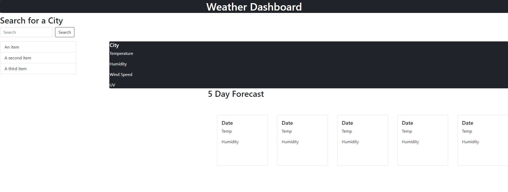

# Weather Dashboard

## Project

Use the [OpenWeather API](https://openweathermap.org/api) to retrieve weather data for cities. Then using local storage to keep your past searches. 

## User Story

As a traveler, I want to see the weather outlook for multiple cities so that I can plan a trip accordingly. 

## Usage

You can use this project by following the link below.

https://gonzalezg97.github.io/homework-wk6-weatherApi/

### Credits

https://openweathermap.org/api

https://jquery.com/

